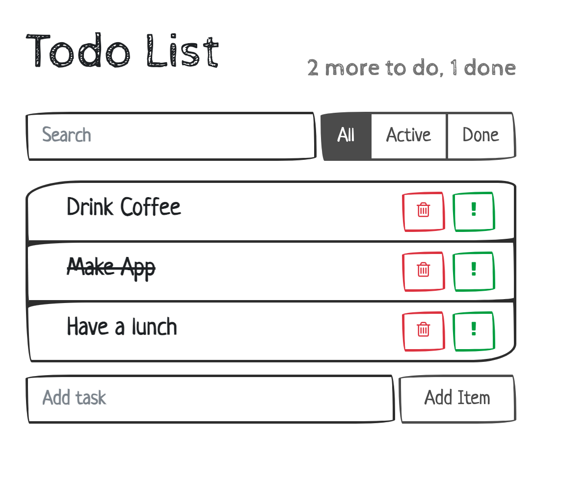

# [Study project] ToDo App

Course - https://www.udemy.com/course/pro-react-redux/

Web application:
- React
- Bootstrap

**Run local**
```shell
git clone https://github.com/sergius-la/stp-todo-app.git
npm start
```

